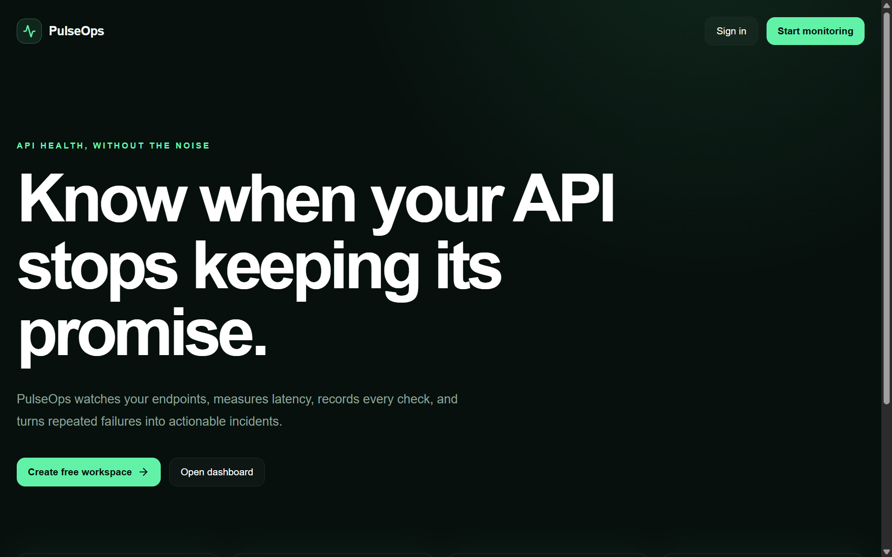
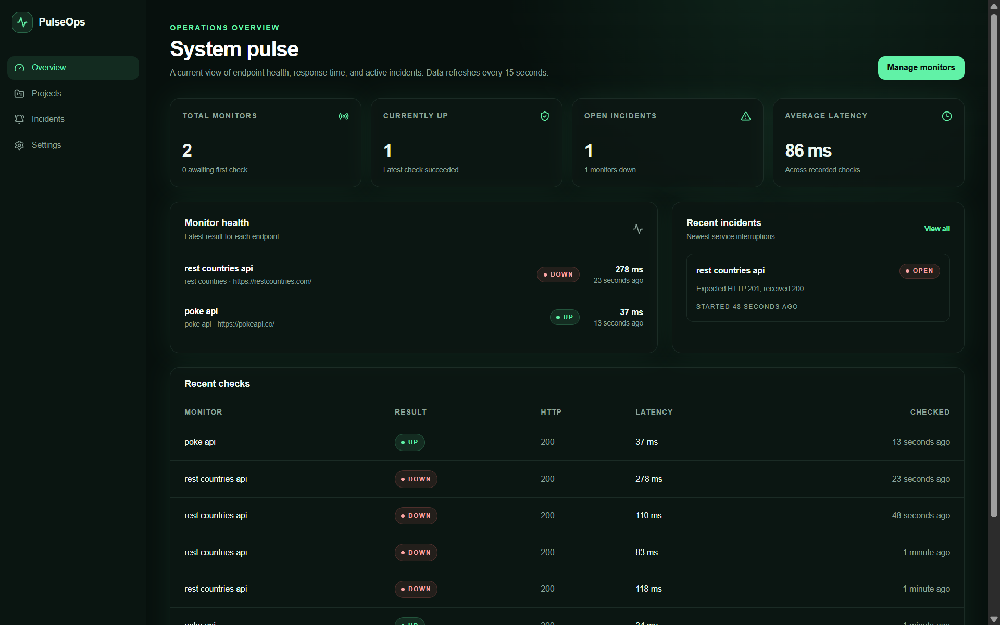
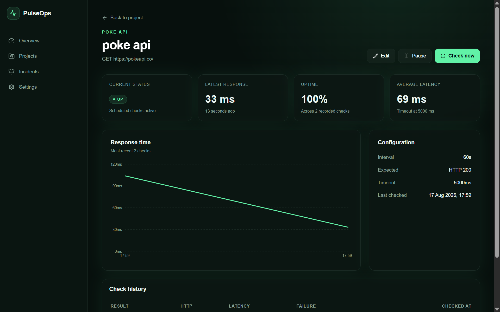
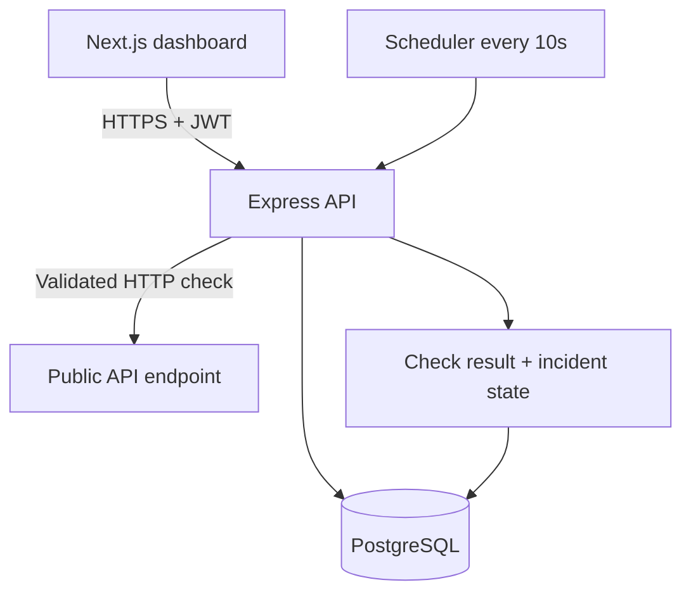

# PulseOps

PulseOps is a full-stack API monitoring and incident-management platform. Users create projects, register public HTTP endpoints, and let a backend scheduler check availability and latency even when the dashboard is closed.

[Live application](https://pulseops-web.onrender.com) · [API health](https://pulseops-api-t6m0.onrender.com/health) · [How PulseOps works](docs/HOW_PULSEOPS_WORKS.md)

> The demo uses Render's free tier. The first request after inactivity can take about a minute while the services wake up, and the free PostgreSQL database expires after 30 days.

## Product preview

### Landing page



### Operations overview



### Monitor analytics



## What it does

- JWT-based registration, login and protected routes
- Project and monitor CRUD with per-user ownership enforcement
- Configurable `GET` and `HEAD` checks, intervals, timeouts and expected status codes
- Background scheduling independent of the browser
- Response-time history, uptime percentage and dashboard metrics
- Incident creation after three consecutive failures
- Automatic incident resolution after a successful recovery check
- Pause, resume and manual **Check now** controls
- SSRF protection for localhost, private networks, reserved ranges and metadata endpoints
- Structured logs with authorization data redacted

## Architecture



The scheduler lives in the backend process, not in the browser. Closing the dashboard therefore does not stop monitoring while the backend service remains running.

## Monitoring flow

1. The scheduler finds active monitors whose `nextCheckAt` is due.
2. A database lease allows only one process to claim each monitor.
3. PulseOps resolves DNS and rejects private, local, reserved and metadata IP addresses.
4. The HTTP connection is pinned to the validated address and follows at most three revalidated redirects.
5. The response status and latency are compared with the monitor configuration.
6. A `check_results` row is stored and the next check is scheduled.
7. Three consecutive failures open one incident; the next successful check resolves it.

## Technology stack

| Layer | Technology |
| --- | --- |
| Frontend | Next.js 16, React 19, TypeScript, Tailwind CSS, Recharts |
| Backend | Node.js, Express 5, TypeScript, Undici |
| Database | PostgreSQL, Prisma ORM |
| Authentication | JWT, bcrypt |
| Validation | Zod |
| Testing | Vitest, Supertest |
| Deployment | Render web services + Render PostgreSQL |

## Repository layout

```text
apps/web          Next.js dashboard
apps/api          Express API, scheduler, Prisma schema and tests
packages/shared   Shared API contracts
docs              Technical project documentation
```

## Run locally

Requirements: Node.js 20.9 or newer, pnpm 11, and PostgreSQL.

1. Create the local environment files.

   Windows CMD:

   ```cmd
   copy apps\api\.env.example apps\api\.env
   copy apps\web\.env.local.example apps\web\.env.local
   ```

   macOS/Linux:

   ```bash
   cp apps/api/.env.example apps/api/.env
   cp apps/web/.env.local.example apps/web/.env.local
   ```

2. Set a random `JWT_SECRET` containing at least 32 characters in `apps/api/.env`.

3. Configure `DATABASE_URL`, install dependencies and apply the migration.

   ```bash
   pnpm install
   pnpm db:migrate
   ```

4. Start the frontend and backend.

   ```bash
   pnpm dev
   ```

Open `http://localhost:3000`. The API runs at `http://localhost:5000` and exposes `GET /health`.

## Useful commands

```bash
pnpm dev          # Start the API and web development servers
pnpm build        # Create production builds
pnpm typecheck    # Run strict TypeScript checks
pnpm test         # Run API unit and monitoring tests
pnpm db:migrate   # Apply a development database migration
pnpm db:studio    # Open Prisma Studio
```

Current verification: **15 tests passed**, one optional database-backed integration suite skipped, and the production build completed successfully.

## Security decisions

- Passwords are hashed with bcrypt using cost factor 12.
- Every protected resource query includes the authenticated user's ownership condition.
- Unauthorized resource access returns `404` to avoid revealing whether the resource exists.
- Monitor URLs accept only HTTP/HTTPS and cannot include embedded credentials.
- DNS safety checks are repeated for redirects and connections are pinned to validated IP addresses.
- Monitored response bodies, passwords, JWTs and authorization headers are not persisted in logs.
- Request body limits, authentication rate limits and write rate limits are enabled.

Browser `localStorage` is used for the JWT as an explicit learning-MVP tradeoff. A public production service should use short-lived access tokens and rotating refresh sessions in `HttpOnly`, `Secure`, `SameSite` cookies.

## Deployment

The root `render.yaml` provisions three resources:

```text
pulseops-web       Next.js web service
pulseops-api       Express API and monitoring scheduler
pulseops-postgres  Managed PostgreSQL database
```

Required production variables:

- API: `DATABASE_URL`, `JWT_SECRET`, `FRONTEND_URL`
- Web: `NEXT_PUBLIC_API_URL`

Render's free web services sleep after 15 minutes without inbound traffic. When the API sleeps, the in-process scheduler also stops. Continuous production monitoring therefore requires an always-running backend plan or a dedicated worker architecture.

## Scope

This repository intentionally keeps the MVP as a modular monolith. Redis, BullMQ, distributed workers, WebSockets, billing, teams, public status pages and notification integrations are deferred until product requirements or measured load justify them.
