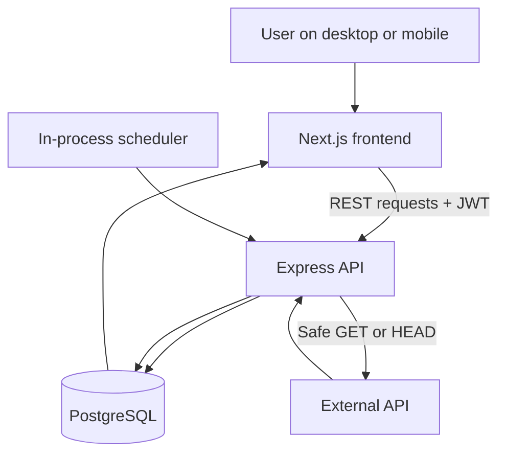
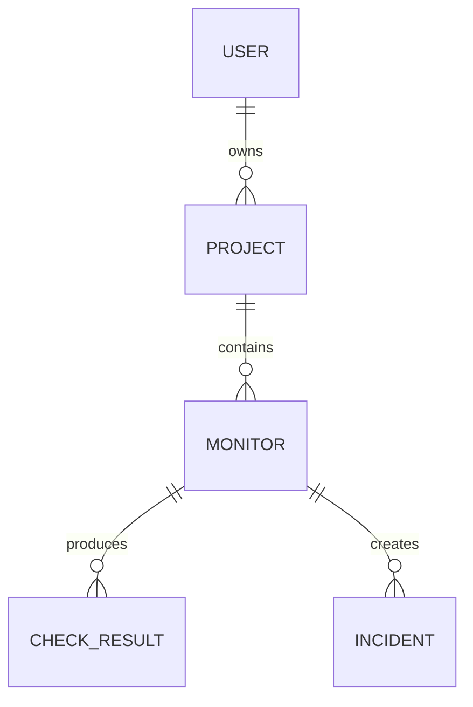
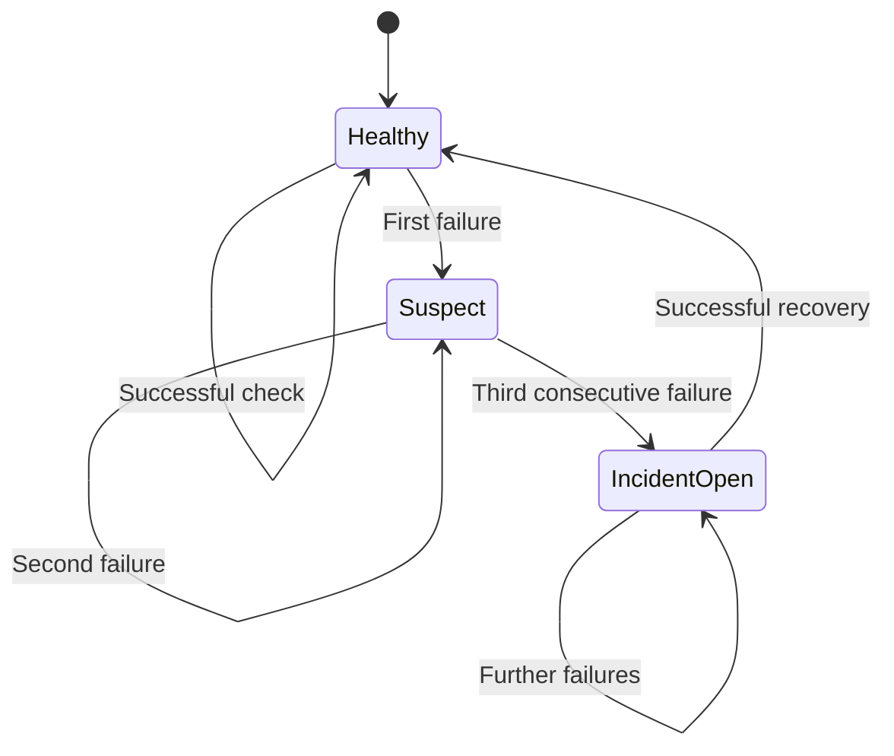
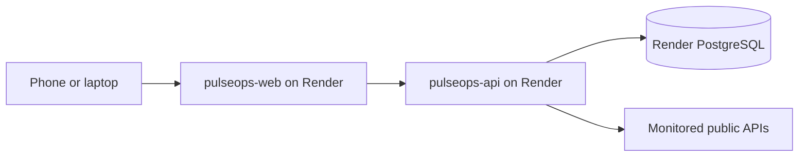

# How PulseOps Works

This document explains the complete PulseOps request flow, background monitoring engine, persistence model, incident rules, security controls, user interface and deployment architecture.

## 1. Purpose

PulseOps answers four practical questions for a developer:

1. Is an API endpoint currently reachable?
2. Is it returning the expected HTTP status?
3. How long does it take to respond?
4. Has it failed repeatedly enough to be treated as an incident?

The important architectural decision is that monitoring belongs to the backend. The browser displays results and lets users configure monitors, but it is never responsible for running scheduled checks.

## 2. System architecture



### Frontend

The Next.js application provides registration, login, dashboard, project management, monitor configuration, response-time charts, check history and incident pages. It calls the API through `NEXT_PUBLIC_API_URL`.

### Backend

The Express application owns authentication, authorization, validation, business rules, HTTP monitoring, metrics, incident transitions and persistence. API routes are mounted under `/api/v1`; `/health` is reserved for platform health checks.

### Database

PostgreSQL stores durable application state. Prisma supplies the schema, migrations and typed database client.

### Shared package

`packages/shared` contains contracts used by both the frontend and backend so common response shapes do not drift independently.

## 3. Data model



### User

Stores identity information and a bcrypt password hash. Email addresses are unique.

### Project

Groups related monitors under one user. Deleting a project cascades to its monitors, check results and incidents.

### Monitor

Stores the target URL, HTTP method, interval, timeout, expected status, active state, next-check time and temporary scheduler lease.

### CheckResult

Stores the status code when available, measured response time, availability result, classified failure information and timestamp. The `(monitorId, checkedAt DESC)` index supports recent-history queries.

### Incident

Represents a confirmed outage. `activeKey` is unique while an incident is open, preventing duplicate open incidents for the same monitor.

## 4. Authentication flow

### Registration

1. The frontend sends name, email and password to `POST /api/v1/auth/register`.
2. Zod validates the request.
3. The service checks that the email is unused.
4. bcrypt hashes the password with cost factor 12.
5. PostgreSQL stores the new user.
6. The API signs a JWT containing the user's ID as the subject.
7. The frontend stores the token and attaches it to protected requests.

### Login and session restoration

Login compares the submitted password with the stored hash and returns a new JWT. When the application reloads, the frontend reads its saved token and calls `GET /api/v1/auth/me`. An invalid or expired token is removed.

### Authorization

Authentication proves who the user is. Authorization decides what that user can access. Project, monitor and incident queries include the authenticated user ID, so knowing another resource UUID does not grant access. Missing and unauthorized resources both return `404`.

## 5. Project and monitor flow

1. A user creates a project.
2. The user adds a monitor with a public URL, `GET` or `HEAD`, interval, timeout and expected status.
3. The API validates both the request shape and URL safety.
4. The new monitor is active and immediately eligible for its first scheduled check.
5. The user can edit, pause, resume, delete or manually check the monitor.

Pausing sets `isActive` to false, so scheduler queries exclude the monitor. Resuming makes it active and sets `nextCheckAt` to the current time. **Check now** performs an immediate check without changing the configured schedule.

## 6. Scheduler and leasing

The backend starts one scheduler with the API process. Every 10 seconds it queries up to 50 active monitors whose `nextCheckAt` is due.

Before executing a check, the scheduler performs an atomic conditional update that places a lease on the monitor. Only the process that successfully changes one row owns that work. The lease has an expiry time, so another process can recover the monitor if the original worker crashes.

The scheduler also has a local `running` guard that prevents overlapping ticks inside one process. Claimed monitors are checked concurrently with `Promise.allSettled`, so one failed check does not cancel the rest of the batch.

After a scheduled check, PulseOps sets the next check time to:

```text
checkedAt + intervalSeconds
```

It then clears the lease.

## 7. SSRF-safe URL validation

Monitoring user-provided URLs creates a Server-Side Request Forgery risk. Without protection, a user could make the server request internal databases, localhost services or cloud metadata endpoints.

PulseOps therefore:

- accepts only `http://` and `https://`
- rejects credentials embedded in a URL
- blocks localhost names
- resolves hostnames before connecting
- rejects loopback, private, link-local, carrier-grade NAT, reserved, multicast and metadata-related IP ranges
- validates every resolved address
- repeats validation after redirects
- pins the HTTP connection to validated DNS results to reduce DNS-rebinding risk
- follows no more than three redirects

The pinned DNS lookup supports both single-address and `all: true` lookup modes used by Node.js and Undici, including Windows behavior.

## 8. HTTP check execution

For every monitor check:

1. Capture a high-resolution start time.
2. Resolve and validate the target URL.
3. Create a temporary Undici agent pinned to validated addresses.
4. Send the configured `GET` or `HEAD` request.
5. Apply header, body and overall abort timeouts.
6. Drain the response body without persisting it.
7. Revalidate redirects before following them.
8. Compare the returned status with `expectedStatusCode`.
9. Record the rounded elapsed milliseconds.
10. Destroy the temporary HTTP agent.

A matching status is `UP`. A different status is stored as `UNEXPECTED_STATUS`. Network exceptions are classified as timeout, DNS failure, connection refused, TLS error, SSRF blocked or general network error.

## 9. Persistence and transaction boundary

The check result and monitor timestamp update run inside one Prisma transaction. This prevents the dashboard from observing a saved result without the corresponding monitor state update, or the reverse.

Incident evaluation happens after the result is stored because it needs to query the latest check history.

## 10. Incident state machine



One isolated failure does not create an incident. On the third consecutive failure, PulseOps upserts one open incident. The unique active key prevents duplicates. Additional failures continue producing check results but do not create more open incidents. The first successful recovery check resolves every open incident for that monitor and records `resolvedAt`.

## 11. Metrics and dashboard

The monitor summary returns:

- current status: `UP`, `DOWN` or `PENDING`
- latest response time
- uptime percentage
- average response time
- last checked time
- total recorded checks

Uptime is calculated as:

```text
successful checks / total checks × 100
```

The dashboard aggregates monitor counts, up/down/pending totals, open incidents, average response time, latest checks and recent incidents. History endpoints are paginated instead of returning an unlimited result set.

## 12. API request pipeline

```text
Browser request
  → Helmet security headers
  → CORS origin check
  → Structured request logging with redaction
  → JSON body-size limit
  → Authentication/write rate limits
  → Route
  → Zod validation
  → JWT authentication
  → Controller
  → Service business rules
  → Repository / Prisma
  → Consistent JSON response or error
```

Controllers translate HTTP input and output. Services contain use-case rules. Repositories contain persistence queries. This keeps responsibilities separate and makes the code easier to test.

## 13. Frontend data flow

The auth provider holds the current token and user state. Feature views call a shared API client, which adds JSON and authorization headers and converts non-successful responses into predictable `ApiError` objects.

The monitor detail page combines monitor configuration, latest summary, paginated history and a Recharts response-time graph. The UI does not calculate authoritative incident state; it displays backend-owned data.

## 14. Deployment



The root `render.yaml` provisions the frontend, API and database. Render injects `DATABASE_URL`, generates `JWT_SECRET`, and runs Prisma migrations during the API build.

Important environment variables:

| Service | Variable | Purpose |
| --- | --- | --- |
| API | `DATABASE_URL` | PostgreSQL connection |
| API | `JWT_SECRET` | Signs and verifies tokens |
| API | `FRONTEND_URL` | Exact CORS-allowed frontend origin |
| Web | `NEXT_PUBLIC_API_URL` | Browser-visible API base URL ending in `/api/v1` |

`NEXT_PUBLIC_API_URL` is embedded during the Next.js build, so changing it requires rebuilding the frontend.

## 15. Validation completed

- Local PostgreSQL migration applied successfully
- Public weather API monitored successfully
- Expected-status mismatch created a controlled failure
- Three consecutive failures opened an incident
- Successful recovery resolved the incident
- Windows DNS-pinning lookup regression fixed and covered by tests
- 15 automated tests passed; one optional database integration suite skipped
- TypeScript and optimized production builds completed successfully
- Frontend, API and PostgreSQL deployed to Render
- Application verified from both laptop and mobile phone

## 16. MVP versus production readiness

PulseOps is a completed learning and portfolio MVP. It demonstrates a production-style design, but the free deployment is not a continuous monitoring service:

- Render free web services sleep after 15 minutes without inbound traffic; the scheduler stops while the API sleeps.
- Render free PostgreSQL expires after 30 days and has no backups.
- JWTs are stored in browser `localStorage` rather than rotating secure-cookie sessions.
- The scheduler and API run in one process instead of a dedicated worker pool.
- There are no email, Slack or webhook notifications yet.
- Raw check-result retention and aggregation policies are not implemented.

A production evolution would use an always-on API, dedicated scheduler/worker processes, Redis/BullMQ or another durable queue, retention jobs, managed backups, secure refresh sessions, notifications and operational metrics.

## 17. End-to-end example

Assume a monitor expects `GET https://api.example.com/health` to return `200` every 60 seconds:

1. The scheduler claims the due monitor.
2. DNS resolves to a public IP and passes safety checks.
3. Undici sends the request through a pinned connection.
4. A `200` response in 84 ms produces an `UP` result.
5. The database stores the result and schedules the next check.
6. If the endpoint returns `500` three times consecutively, one incident opens.
7. Later, a `200` response stores another result and resolves the incident.
8. The dashboard shows the recovered status, updated uptime, latency history and incident timeline.

That flow is the core of PulseOps: **configure → schedule → validate → check → persist → evaluate → visualize**.
